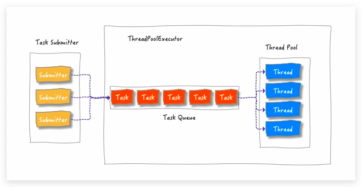
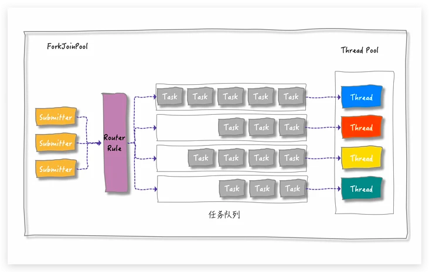
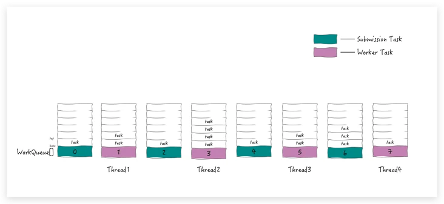
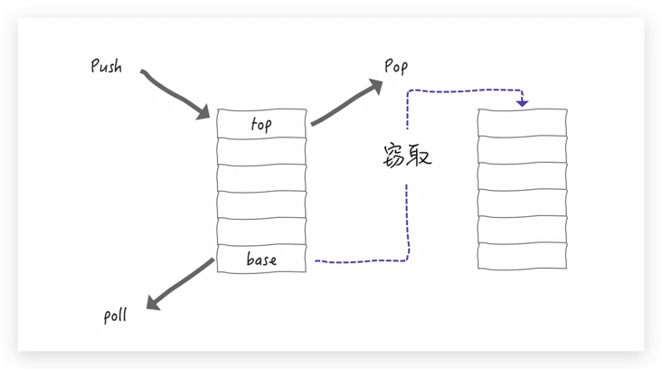

 # FockJoinPool
 
---------
- ForkJoinTask
>
>  先说ForkJoinTask，它实现了Future接口，核心方法是fork和join；
> 
> fork用于异步执行一个子任务;join用于阻塞当前线程，等待子任务的执行结果；
> 
> 它有两个抽象子类：RecursizveAction（没有返回值），RecursizveTask(有返回值)
> 
> 如其名字，其目的是要让其实现类遵循**分治**的思想来充血执行逻辑；
> 
> 简单来说
>
    if(任务小到不用继续拆分）{
        直接计算得到结果
    }else{
        拆分子任务
        调用子任务的fork()进行计算
        调用子任务的join()合并计算结果
    }
> 
 - 为什么有了ThreadPoolExecutor还要有ForkJoinPool
>

> 
> ThreadPoolExecutor是典型的生产者-消费者模式，消费者线程从同一个任务队列中消费提交的任务；
> 
> ThreadPoolExecutor简单的并行操作主要是为了**执行时间不确定的任务**（IO或者定时任务等）
> 
> 然而，ThreadPoolExecutor不适合处理分治这种**父子任务依赖关系强**的任务；
> 

>
> 如图所示，forkJoinPool有多个任务队列，即一个变量 WorkQueue[]；
> 

> 
> 通常来说：
>   
> 外部提交的任务，放在 偶数 队列中；
> 
> 任务自己fork出来的子任务，放在 奇数 队列中；
> 
> 由于每个任务的执行时间是不同的，且负载也会是不同的，为了最大化利用cpu资源，允许空闲的线程，**窃取**其他队列中的任务；
> 

> 
> 线程窃取任务时和正常从队列中取任务的方式不同，窃取的是较晚入队的任务（从队尾拿）；
> 
- TOOD 其他细节
> https://segmentfault.com/a/1190000039267451