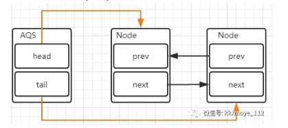
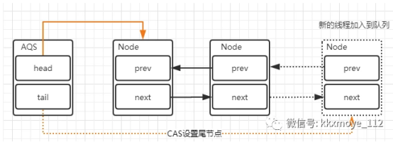

 # syhcronized关键字，RentryLock
  ----------

 - 1 sychronized实现原理
 >
> sychronized是java的关键字，其加的锁会自动释放，是JVM层面的锁；
> 
> 可以用来修饰代码块，方法，类等位置，也可以加在某个变量上；
> 
> 类锁：对该类的所有对象都生效（例如，修饰类的静态方法，修饰该类的Class对象）；
> 
> 对象锁：锁住某个变量，其他线程访问这个变量时会被阻塞；

> sychronized会在字节码中添加monitor enter和monitor exit，被锁的对象（类就类型对象，
> 变量就锁变量）都有一个monitor监视器，monitor enter会尝试获取这个monitor，如果获取成功（即当前同步计数count=0）
> 同步计数器count+1，由于sychronized是可重入锁，因此每次在已经获取了锁的方法内有其他方法重入进来时候count就+1，
> 这样就保证了获得锁的线程的关联线程完全执行完毕后才会释放锁；
> 
 
> 锁升级过程：无锁-偏向锁-轻量锁-重量锁；
> 
> 无锁：即没有任何线程访问同步代码/变量的状态，当出现第一个线程来获取共享资源时，就升级为偏向锁；
> 
> 偏向锁：只有一个线程在占用同步资源（偏向就是偏向它）
> 
> 轻量锁：当只有一个线程在等待共享资源时，采用自旋的方式来等待；如果等待时间过长，会升级为重量锁；
> 
> 即悲观锁：一个线程占用共享资源，其他线程被阻塞；

 - 1 reentryLock
>
> 相对于sychronized：
> 
> 1. 是一个包，是JDK层面的；
> 
> 2.必须手动释放；
> 
> 3.可以中断，sychronized不能中断；
> 
> 4.可以构造公平锁
> 
> 5.sychronized性能更高（它的实现方式更底层，用的是本地方法），但是锁升级的过程不可逆，一旦升级为重量锁，可能阻塞大量线程；
> 

> reentryLock的原理AQS机制；
> 
> AQS即AbstractQueuedSynchronized，它实现的锁有两种：独占锁和共享锁；
> 

> 其实现是一个带头节点的双向队列；每一个节点都代表着参与竞争的线程（包含了线程的基本信息）；
> 
> 线程请求同步资源时，如果请求成功，则被添加到队列的头部，表示它是当前锁的持有者；
> 

> 
> 如果竞争失败，则会被插入队列的尾部；插入节点以及移除队头节点的时候都需要使用CAS机制来保证操作的原子性；
> 
> 防止因为并发导致等待队列的乱序；
> 
> reentryLock的非公平锁实现（TODO）