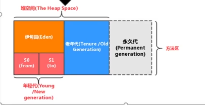
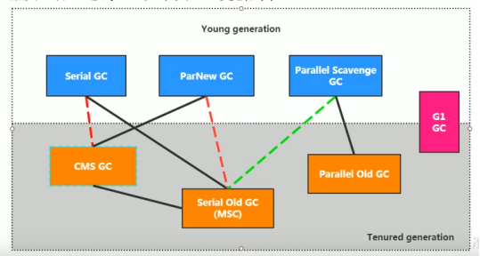
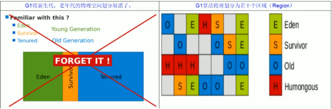

# Java垃圾回收器
相关代码: GC
----------
- Java中的垃圾
> 首先要明确，什么是垃圾？
> 
> 简单来说，内存（包含jvm运行时数据区和直接内存区）中不会再被利用的空间就是垃圾；
>
> 具体来说，有被分配在堆中的对象，被分配在元空间中的类对象，静态变量等等，都可能成为垃圾；
>
> 那么jvm是如何确定哪些对象是垃圾的？
>
> 主要基于GC root可达性分析；
>
> 该算法是以根对象（GC root对象）作为起点，向下dfs，从这些根节点能到达的所有节点（即它们直接或者间接关联的对象），
> 都是存活对象，未能被标记的对象，就是垃圾对象；
>
> **通常可以作为根节点的对象有**：
> 
    1.虚拟机栈中的变量和对象；
    2.本地方法栈中的变量和对象；
    3.元空间中静态变量所引用的对象；
    4.元空间中常量池中引用的对象；
    5.被同步锁synchronized锁定的对象；
    6.由系统类加载器（boostrap classloader）加载的类对象，这些类是不能被回收的；
    7.堆空间中的记忆集；
----------
- 堆空间的分代设计
> 堆空间通常分为几个区域：年轻代，老年代，永久代（元空间/方法区）
> 

>
> 顾名思义，年轻代存放的是刚被实例化的对象或是已存在时间较短的对象；老年代存放的是存活时间已经很长的对象；
> 永久代则存放的是Class对象；
> 
> 年轻代又具体划分为三个区域，伊甸园区，幸存者区1，幸存者区2；
> 
> 对象的内存空间分配，通常是由年轻代开始的；
>
     1.首先在伊甸园区分配空间给new的对象；
        如果伊甸园区的内存不够了，会触发（young GC)回收伊甸园区的内存空间；
        将伊甸园区的存活对象和幸存者1区的存活对象移动到幸存者2区；
        并给这些对象的年龄计数器+1，然后调换两个幸存者区的标记，即当前的幸存者2区变为下一轮的幸存者1区；
        通常，如果年龄计数器到达16，则对象会被移动到老年代；
        
     2. 特定情况下（伊甸园区的空间不足，young GC之后仍然不足），会直接在老年代给对象分配空间； 
        
----------
- 垃圾回收算法
> java垃圾回收中的垃圾回收算法主要指下面四种；
>
> 标记-清除算法
>
    从GC Root对象出发，标记存活对象；
    清除垃圾对象，回收它们占用的内存空间，由于这一过程耗时较大，会造成比较久的STW(stop the world,
    即只有垃圾回收线程在工作的状态，用户线程将会被挂起)，对用户来说体验并不好，并且会产生内存碎片；
    该算法通常作为备用方案；
> 标记-整理算法
>
    从GC Root对象出发，标记存活对象；
    从某一块完整的内存空间头部开始，将存活对象逐一存放到该内存空间下，同样会造成较长的STW；
    好处是不会产生内存碎片；
    该算法常常用在老年代等不活跃的内存区域；
> 复制算法
>
    需要两块完整的内存空间，称之为P1,P2；
    假设当前对象存放在P1,从GC Root出发，标记存活对象；
    将存活对象移动到P2中，并从头开始依次存放，避免内存碎片；
    调换P1和P2的指针，即代表回收了当前P1的空间，当前P2将作为下一轮P1继续使用；
    该算法同样避免了内存碎片，是许多垃圾回收器的主要运作原理；
----------
- 垃圾回收器
> 主要指的是以下7种；
>
> 其关系主要如下图;
>

>
> 
> Serial
>
    串行工作，为单线程环境设计，可以工作于年轻代；
    工作时会挂起用户线程，
    对年轻代使用复制算法；
    对老年代使用标记-整理算法；
> ParNew
> 
    并行工作，为多线程环境设计，有多个垃圾回收线程，工作于年轻代，采用复制算法；
    以响应速度为目标，主要配合CMS使用；
> Parallel
>
    并行工作，为多线程环境设计，有多个垃圾回收线程，工作于年轻代，采用复制算法；
    以吞吐量优先，适用于不太要求响应速度的后台运算环境；
> Serial Old
>
    工作于老年代的串行回收器，串行回收器主要是配合其他回收器使用，起到一个备用方案的作用；
> Parallel Old
>
    作用于老年代的并行回收器，采用标记-整理算法；
> CMS
>
    并发回收器；
    强调快速响应，适用于交互较多的场景；
    采用标记-清除算法；
    将整个回收过程分为四个阶段：
        1.初始标记（造成STW）：标记GC root的直接可达对象；
        2.并发标记：和用户线程并发执行，标记所有间接可达对象；
        3.重新标记（STW）：由于步骤2与用户线程并发，所以可能产生新的垃圾，所以在这里修正产生变动的标记；
        4.并发回收：和用户线程并发执行，将未被标记的垃圾进行回收；
    上述过程将最消耗时间的可达性分析流程和垃圾回收流程与用户线程并发，大幅缩短了STW的时间，使响应时间变短；
    但是由于回收过程要和用户线程并发，所以只能采用标记-清除算法，这也会产生内存碎片和浮动垃圾；
    使用CMS回收器的时候要保证预留充足的内存，否则如果内存空间不足，会强行启动备用方案（Serial），导致更长
    的STW；
> G1
> 
> G1回收器的出现是为了取代CMS回收器；
> 
> 它拥有高吞吐量的同时，保证了高相应比，同时不会产生内存碎片；
>

>
> 具体来说，它不再将内存区域划分为整的大块区域，而是将其划分为大小一致的小块；
>
> 并为这些小块(region)指派具体的功能；
>
> 这样做的好处就是，因为其回收和移动是以region为单位的，**所以再STW的时间上更加可控**；
> 
> 如果设置了最大STW时间，那么G1回收器会按照**回收价值**（即回收某个region可以获取多少空闲空间）来自行判断优先回收哪些regions；
>
    region通常可以被指派四种功能，即图上的E（伊甸园区），S（幸存者区），O（老年代），H（巨型对象）
    
    通常，对象将会被分配到E region，当触发了GC的时候，会使用复制算法将某些待回收的E region和S region
    的存活对象移动到其他的空白 region，然后这些空白region被标记为S region，并为这些对象的年龄代数+1,
    回收过后的E region, S region，被标记为空白 region，可以用于未来分配为其他功能区；
    
    如果遇到一个region放不下的巨型对象，则会选择分配给它几个连续的region，并标记为H region；
> 这样的内存分配方式，不会产生内存碎片，各功能区的大小灵活调配，并且STW的时间可控；
----------
- 其他问题
> 关于STW；
>
> 出现STW的地方主要是三点：1.可达性分析期间；2.复制算法移动存活对象；3.标记-整理算法移动存活对象；
>
> 关于内存溢出和内存泄漏（详细见 常见OOM和内存泄漏 章节）；
>
> 内存溢出（OOM）指的是在程序申请内存时，无法提供足够的内存空间
>
> 内存泄漏指的是，程序申请内存后，因为某些原因，导致一些没有用的内存区域无法被回收，一直被占用却没有利用，
> 导致内存浪费
>
> 关于记忆集和写屏障：
>
> 我们知道，JVM中堆空间是采用分代设计的，GC发生的时候，是通过GC root可达性分析，来判断某一块（代）
> 内存区域的存活对象的；
>
> 假设存在另一块（代）内存中有对当前要回收的内存区中的对象的引用，而该引用又没有被标记为GC root时，
> 可能会发生GC之后产生悬空指针，带来危险；
>
> 所以JVM中有一个表用来记录这种堆内存内部的局部引用关系，这个表就是记忆集;
>
> 表当中每个元素对应了内存中一块连续的区域是否有跨代（局部）引用的现象，如果有，则标记为“脏”，在可达性分析的时候
> 要将跨代引用的源头作为根节点来考虑；
> 
> 而JVM维护记忆集的机制就是写屏障；
>
> 其实就是**对一个对象引用进行写操作（引用赋值）之前或之后附加执行的逻辑**；
>
> 也即在进行引用赋值之前，若出现跨代引用，则将对应的内存块在记忆集中标记为“脏”