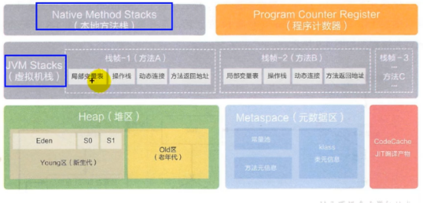

# 运行时数据区
----------
> 引用一张很常见的jvm运行时数据区结构图；
> 
> 

> JVM运行时数据区，通常指图中的5个部分：
> 
> 虚拟机栈，堆空间，元空间，本地方法栈，程序计数器；
----------
 - 程序计数器
> 首先，我们要明白，jvm的多线程是通过时间片轮转算法来实现的。
> 
> 即是说，某个线程在其被分配的时间片耗尽之后，会被暂时挂起，直到再次被分配到cpu；
> 
> 那么这段时间里有其他线程会占用cpu，当重新切换回刚才那个线程时，它需要知道自己的程序执行到哪里了;
> 
> 所以这个任务就交给程序计数器完成；
> 
> 程序计数器是**线程私有**的，即每个线程拥有自己的程序计数器，它被用来记录程序当前执行到的位置（即执行到哪条字节码）；
>
> 你可以认为它是当前线程所执行的字节码的行号指示器;
----------
 - 虚拟机栈，本地方法栈
 > 栈同样是线程私有的，每个线程都有自己的虚拟机栈，它记录着线程运行的过程；
 >
 > 每一个方法从调用到执行完成的过程，就对应一个栈帧在虚拟机栈中入栈到出栈的过程；
 >
 > 栈内部存放的是一个个的栈帧，每次进行方法调用时，会压入新的栈帧，记录运行状态等，当方法执行完成，就会弹出它对应的栈帧；
 > 
 > 虚拟机栈是有大小限制的，否则无限的递归会导致内存爆炸（具体可以查看运行参数）
 > 
 > 本地方法栈就是专门给本地方法用的；
 >
 > 如果线程请求的栈深度超过了虚拟机允许的深度上限，会出现StackOverflowError；
 > 如果虚拟机栈无法申请到组够的内存，会出现OOM（OutOfMemoryError）；
 
    每个栈帧主要包含了：
    局部变量表：存放了 编译期间 可知的各种基本数据类型，对象引用；
                其中，long，double类型的数据会占用两个局部变量空间(slot),其他都是占用一个；
                局部变量表的内存空间分配会在编译期间完成分配，当进入一个方法时，这个方法需要
                在帧中分配多大的局部变量空间是 完全确定 的；
    
    操作数栈：运算的时候压入和弹出操作数（想象一下后缀表达式求值那个栈）
    
    指向运行时常量池的引用（动态链接）：支持方法调用过程中的动态连接；java源文件被编译到字节码文件中时，所有的变量和方法都作为符号引用保存在class文件的常量池中；
    比如，当一个方法调用了另一个方法时，就是通过这个动态链接转换进行调用；
    
    方法的返回地址；
 ----------
 - 堆内存区，元空间
 > 堆内存区和方法区（元空间）是以进程为分配单位的，通常每个运行的程序对应一份；
 > 
 > 进程中的所有线程共享着堆内存区和元空间；
 >
 > 堆内存区是jvm中主要存放对象数据的区域（具体参考GC章节），方法区主要存放的是类对象（Class对象）；
 >
 > 数组和对象不可能被存储在栈中，因为栈帧中仅仅保存的是它们的引用；
 >
 > 如果堆空间或元空间没有组够的内存分配给对象，会出现OOM；
    
    实际上，堆空间并不是完全共享的；
    JVM为每个线程分配了一个私有区域TLAB（Thread Local Allocation Buffer)，线程创建对象时，会优先选择在TLAB中创建，如果空间不够，
    再选择共享的堆空间；当然，因为TLAB通常只占堆空间的1%大小，所以并不能满足所有需求；不过对于小型对象，完全可以分配再线程独享的TLAB中来避免线程安全问题；
 > 关于常量池表，运行时常量池
 
    常量池表包含数量值(final)，字符串值，类引用，字段引用，方法引用；虚拟机会根据这张表找到要执行的类名，方法名等；
    它是class文件的一部分，存放了上述在编译过程中形成的字面量和符号引用（上面的动态链接就是靠这个实现的）；
    因此它在类被加载之后，跟随类对象一起被存放在方法区中，常量池表被加载进方法去之后被称为**运行时常量池**；
 ----------
 - 直接内存区
 > 直接内存**不属于**运行时数据区，不是GC管辖的范围，其大小也不取决于jvm分配的内存大小，而是取决于本机的总内存；
 >
 > 这部分内存在NIO中被频繁使用，如果超过了物理内存限制，也是会报OOM的；