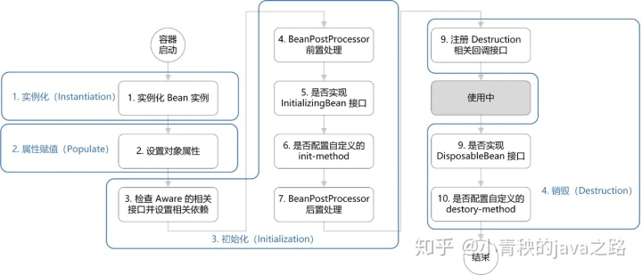

# Bean的生命周期
----------
> 概括起来就是四个阶段：
> 
> 1.实例化 2.属性赋值 3.初始化 4.销毁
> 

>
> 1.实例化：实例化一个bean对象
> 
> 2.为bean设置相关属性以及依赖（循环依赖的解决）
> 
> 3.初始化，途中的3--7步为完整的初始化操作
> 
    3.1 Aware接口的依赖注入， 通过让bean实现Aware接口，获得spring容器的资源；
    包括：beanNameAware：注入当前bean的beanName
         BeanClassLoaderAware：注入加载当前bean的classLoader；
         BeanFactoryAware：注入当前beanFactory容器的引用；
         EnvironmentAware：注入environment，用于获取配置属性等；
> 
> 
    3.2 前置处理器是BeanPostProcessor，在初始化操作前后，
        spring提供的bean拓展点，可以用于实现aop，生成代理类等；
>
> 
    3.3 initializingBean喝init-method等初始化操作
> 4.销毁，图中的8--10步为销毁过程
> 
> 主要涉及注册销毁相关的回调接口，通过DisposableBean喝destroy-method等进行销毁；