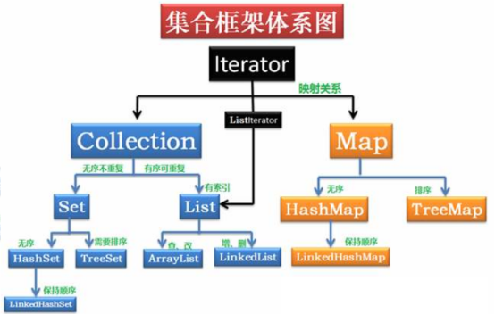
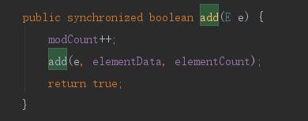
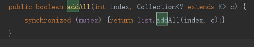
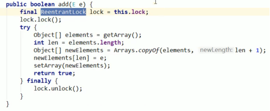

# Java集合类
相关代码 : 

 - 1 集合类基本关系

>
> 由Iterator接口起，所有的集合类都实现了Iterator接口；
> 
> 其中主要包括两类：Collection，Map；
> 
> Collection接口下又分为Set,List；
> 
> Map接口下有HashMap,TreeMap等
----------
 - 2 List类
> 常用的List类分为ArrayList和LinkedList，二者的区别在于：
> 
>   1.ArrayList的存储结果是数组，LinkedList的存储结果是带头尾节点的双向链表；
>   
>   2.ArrayList再空间不够时会自动扩容（1.5倍），默认长度为10；LinkedList不需要扩容；
> 
>   3.ArrayList查询效率高，插入/删除效率低（需要移动其他元素）；LinkedList查询效率低，插入/删除效率高；
> 
 - 2.1 List类的线程安全问题
> ArrayList和LinkedList都是线程不安全的，多线程同时修改（例如add）会触发 java.util.ConcurrentModificationException
> 
> 解决方式：
> 
>   1.Vector类，Vector类用sychronized实现了一个线程安全的ArrayList；
> 

> 
>   2.另外，Collections.sychronizedList(new ArrayList<>()) 也可以弄出线程安全的List; 不同之处在于，这里是给信号量枷锁，而Vector中是方法上加锁；
> 

>
>   3.写时复制，CopyOnWriteArrayList 类，
> 

>
----------
 - 3 Set类

----------
 - 4 HashMap一家