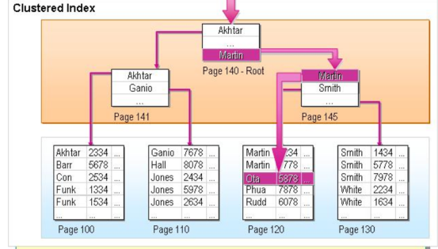

# mysql的逻辑架构

----------
> 引用一张很常见的jvm运行时数据区结构图；
> 
> 

> 通常来说，sql分为应用层，service层，引擎层三个层次；
> 
>   第一层主要提供连接处理，授权认证，安全信息处理等功能；
> 
>   第二层为mysql的核心功能，包含查询，分析，优化，缓存等功能，都是在这里实现的；
> 这一层也实现了所有跨引擎的功能：存储过程，触发器，视图；
> 
>   第三层为引擎层，负责数据存储，不同引擎的差异在这一层体现；
> 

 - 连接器
>   
>   连接器主要负责和用户建立**TCP连接**，进行身份验证；
> 
>   默认情况下，8小时没有活跃的连接会被自动断开，当然，可以选择使用长连接；
>   
>   需要注意，大量使用长连接，会导致OOM，因为建立与保持连接都需要内存；
> 
 - 缓存
> sql提供了类似redis的缓存功能，提供基于key-value的缓存；
> 
> 但是由于每次update时都会清空缓存，所以sql的缓存实际命中率并没有想象的高；
> 
>  尤其不适合需要经常update的场合；
> 

- 数据库存储引擎

  
> 如表格中所示，常见的两种sql引擎：MyISAM，InnoDB；
> 
> 二者的主要区别在于：
> 
>   是否支持主外键
> 
>   是否支持事务
> 
>   默认的锁等级
> 
>   缓存对象
> 
>   表空间大小
> 

> 此外二者的索引存放方式也有所不同；
> 

> 在myisam中，通常会存储三个文件：索引文件，表结构文件，数据文件
> 
> （由于会保存表的总行数，因此执行select count(*) from xx 会比innodb更快）
> 
> 从图中可以看出，索引文件中每个索引都存储着指向数据文件的指针（非聚集索引：数据的物理顺序和逻辑顺序不一致）；

> 反观innodb的索引结构，数据是直接存放在叶节点上的（此处展示的是主键索引）；
> 
> 这种存放方式为聚集索引（数据的物理顺序和逻辑顺序一致），相对于myIsam，innodb中的主键索引不在分出一个数据文件，
> 这意味着，主键索引将会直接**决定数据的排列方式**，因此即便不指定，innodb也会自动建立主键索引；
> 
> innodb的非主键索引，索引叶节点中存放的是**建立索引的字段以及主键索引的值**，
> 相对于myisam直接在叶节点上存储数据指针的方式，innodb在非主键索引没有保存要查询的字段的情况下，
> 需要根据查到的主键索引，进行一次**回表**操作，将剩余的要查询字段找到

