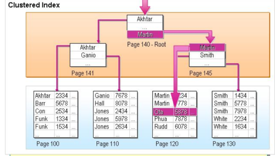

# mysql的索引

----------

- 索引的数据结构
> 索引的数据结构是一个B+树；
> 
> 数据结构决定了查询数据时**需要访问磁盘的次数**
> 
> 1、之所以不采用二叉树/平衡树/红黑树，是因为它们深度过大，可能查询效率会很低；
> 
> 2、不使用线性表是因为线性表虽然有很高的查询效率，但是在插入和删除数据时，要进行大量的数据移动；所以仅适合存储**静态数据**
>
> 3、不使用hashMap是因为hashMap查询单个数据的效率很高，但是难以实现高效的范围查询；
> 

> 反观B+树，由于B+树的多叉平衡树的性质，查询效率不会太低；
> 
> 此外，在每个分支节点都可以进行高效的范围查询；
> 
> 那么和B树比起来有什么优势？
> 
> 1、由于B树要将数据存储在分支节点上，因此查询效率不固定，可能一层就找到，也可能要遍历的比较深；
> 
> 2、B+树的IO次数更少，原因有两点：B+树的内部节点不包含数据信息，因此可以在同一个内存页下存放更多key，具有更好的局部性（内存上看）；
>   其二是内部节点存放在硬盘上时也更加紧凑，更容易一次性读取（外存上看）；这两点都可以减少**IO的次数**
> 
> 3、B+树的数据都存放在叶子节点，比B树更容易进行范围查询（想象一下，B+树要范围查询的时候需要访问多个内部节点下的数据，这有可能会造成多次IO）；
> 
- 覆盖索引（复合索引）
> 非聚集索引（主键索引）下的其他索引，分为单一索引和复合索引；
> 
> 相比单一索引，复合索引的好处在于；
> 
> 复合索引的叶节点存放的是 建立索引的字段以及聚合索引字段 ，因此当查询的字段被索引的字段所**覆盖**（当然得保证不失效）时，可以直接从当前索引的叶节点下取得数据
> 不用进行一次回表（即根据聚合索引去聚合索引文件下查询数据的所有字段）；
> 
- 索引失效的情况
> 1、最佳左前缀法则：查询的字段和建立索引的字段顺序最好一致（复合索引的查询过程是：先匹配字段a，字段a相同的时候，再继续匹配字段b。。；），从不一致的地方开始，后面的字段的索引将失效；
> 此时如果无法凭借前面一致的字段定位到数据，会进行**全表查询**；
> 
> 2、在索引上进行操作（计算，调用函数，类型转换，!=,<>等比较符号，以及 is null），这些都会造成索引**直接失效**；
> 
> 3、范围之后全失效，查询条件中有用来锁定范围的字段的话，该字段后面的索引字段都会失效；
> 
> 4、通配符，like "%xx"， %通配符如果加在字符串左边，则会导致用来匹配的那个索引字段失效；
> 
> 5、如果Or条件两边有一个不是索引字段，则哪怕另一边是索引字段也会失效，即两边都必须是索引字段；