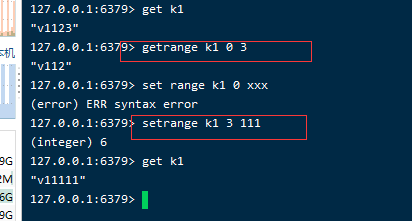

# redis数据结构
----------

- 特性：
> 1.存放在内存，纯内存数据库
> 
> 2.用epoll进行非阻塞IO，保证IO的多路复用；
> 
> 3.单线程处理，避免了线程的频繁切换；
> 
- 持久化
> 
> 
- 数据类型
>
> 1.String
> 
> String类型包含三种内部编码格式：
> 
> int：8个字节的长整形
> 
> Embstr: <= 39个字节的字符串
> 
> raw: > 39个字节的字符串
> 
> 一个key对应一个value，一个redis String value最多能有512M的大小；
> 
> 通常用来作简单的kv对，比如：微博粉丝数量，快速计数（redis有针对int型进行快速+1，-1的api），
> 共享session（将用户的session串直接存在redis中，避免每次都进行IO去获取）等
> 
>

>
> expire key (second) 设置key的过期时间
> 
> ttl key 查看key还有多久过期
> 

> append：字符串拼接
> 
> strlen：返回该key的长度
> 

>
> 这些是针对值为整数的string类型key的命令，用于加减（可以用于计数）
> 

>
> 操作子串用的
> 

>
> setex: set with expire 设置某个key，带上过期时间
> 
> setnx: set if not exits 如果不存在，就新建这个key（这个是一条阻塞命令，即是分布式锁的原理）
> 

> 2.Hash类型
>
> ziplist压缩列表：当哈希类型元素个数和值小于配置值时会使用ziplist进行数据压缩；
> 
> hashTable：当超出ziplist的限制条件时会恢复为hashtable类型，以保证读写的复杂度；

> 
> 该数据结构特别使用用来存放自定义的数据对象；
>

>
> 可以一次设置一格key的多个(key-value)映射，因此hash适合存储自定义的数据结构（DAO）；
> 

>
> 删除某个key；
> 

>
> 3.List
>
> 同样分为zipList,LinkedList；
> 
> 可以用来实现 消息队列， 用rpush+lpop的命令组合，就能将linkedlist类型作为消息队列使用；

>
>

>
> 注意这个push是有方向的，因此可以用lpush,rpush,lpop,rpop这样的命令，用list类型构造栈以及队列（消息队列）；
> 

>
> 这条命令从一个列表中弹出，放入另一个列表中；
> 

>
> 插入命令
> 

>
> 4.set
> 
> 类比java里面hashMap和hashSet的关系，这个也可以对比上面的hashTable；
>
> 

>
> sadd：将元素放入set中；
> 
> smembers：查看集合中的成员
> 
> sisimember：看某个key是否在集合中
> 

>
> 这个命令比较有意思，随机取得几个成员变量，可以用于随机抽奖等；
> 

>
> 这个跟上一个不同的地方在于，上一个是获取，这一个是弹出
> 

>
> 求 差集，交集，并集
> 

>
> 5.Zset
> 
> 比较值得一提的是这个sorted set类型；
> 
> 它是一种自带排序的set类型，对其传入key时要同时传入score值，redis会依据这个score值对key进行排序
> 如果score值相同，则会按照key的字典序进行排序插入；
> 
> 其内部结构是 跳跃表：
> 
> 它是一种多层的链表结构；

> 
> 如图所示，如果查找7，会先查红色那条线（即间隔为2的线），查到11时确定范围在11这个节点的前方；
> 
> 此时缩小查找范围，在间隔为1的链表中查；
> 
> 即整体将链表分为不同间隔，通过大的间隔缩小查找范围，而后通过小的间隔确定查找对象；
> 
> 这种类似二分的查找方式，能将复杂度降低到O(logn)；
> 

>
> 跳表的插入过程比较复杂，先通过上面的查找过程，确定插入位置，然后逐层判断，是否要在该层对应间隔的链表下插入这个节点；
> 通常难以保证每个节点都在每一层链表有连接；
>
>

>
> 设置key，同时设置分数
> 

>
> 查询key，以及对应分数（0，-1）表示全部
> 

>
> 查询某个分数段的key，limit可以限制输出该分数段的第几名到第几名
> 

>
> zcount：查某个分数段的成员个数
> 
> zrank：查某个key的排名
> 
> zscore：查某个key的评分