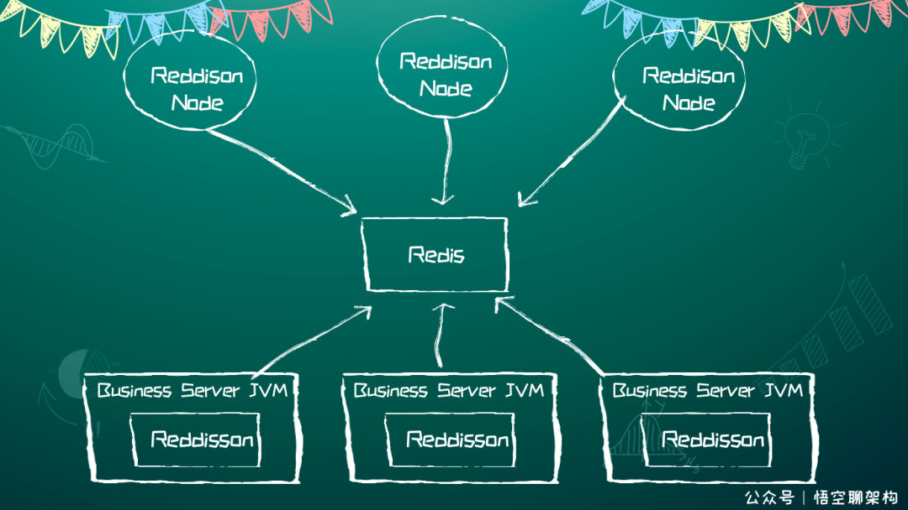
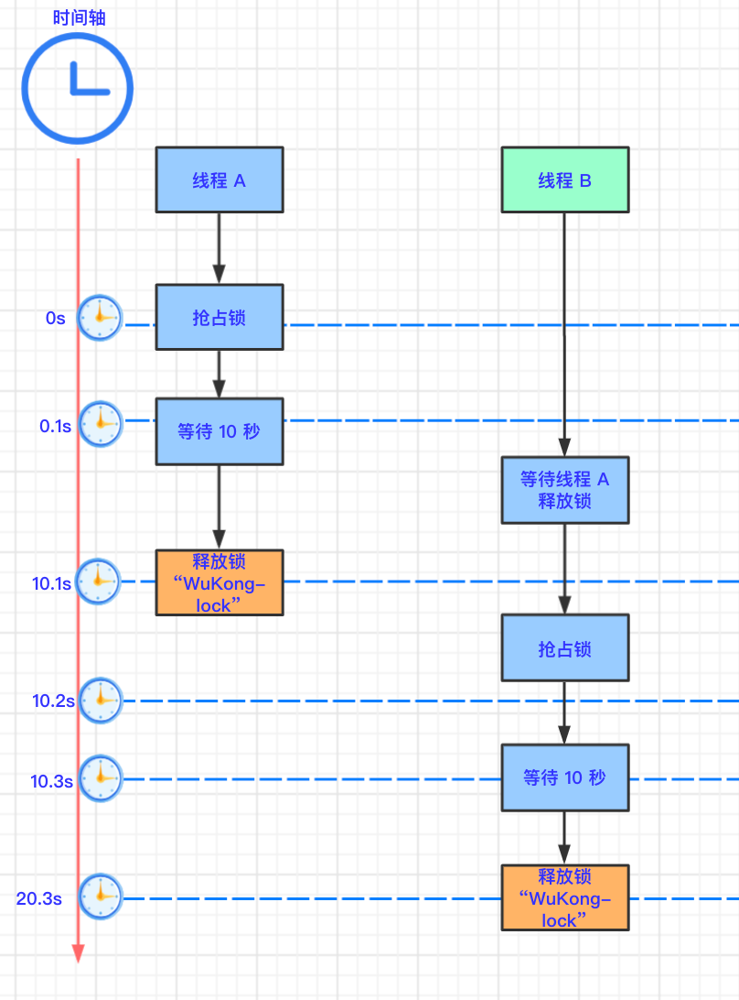

# redis简介
----------

> redis是内存数据库，读写速度很快，适合用作缓存；
> 
> 除了用作缓存，还经常被用来坐**分布式锁，限流器或者消息队列**；
> 

- 分布式锁redisson
> 
> resisson是一个再redis基础上实现的java驻内存数据网格？
> 

>
> 1.redisson采用了基于NIO的netty框架；
> 
> 2.将redis的hash，list，set，string等，封装为java里的map，List，Set，Object Bucket（通用对象桶）
> 
> 3.分布式可重入锁；
> 

>
> 这其中，如果线程A再等待过程中，服务突然挂了，那么redis会释放锁吗？还是造成死锁，阻塞i其他进程？
> 
> 事实上，redisson提供了一格监控锁的”看门狗“，只要锁被占用，就会启动一格定时任务，每间隔10秒就重新给锁设置过期时间；
> 而如果服务挂了，那么“看门狗”定时任务也就挂了，因此，自动重置过期时间也就不存在了，到时间锁就会过期；
>
> 
- 持久化，主从复制，哨兵机制
>
> rdb，将内存中的数据快照写入磁盘并进行压缩（写入过程是由一格进程单独进行），产生dump.rdb文件，
> 重启时会加载该文件进行数据恢复，是默认的持久化方式；
> 
> aof方式，以日志的方式记录操作（对照mysql的binlog）；
> 重启时会执行这些日志进行数据恢复；
> 
> rdb进行数据恢复时更高效，但一旦快照写入过程出现问题，则持久化失败，数据丢失比较多；
> 而aof相对安全，但进行数据恢复时速度比较满； 因此通常是二者一起使用；
>
> 哨兵其实就是一个特殊的redis服务器，它负责确认master以及各个slave节点的存活状态；
> 并在master节点挂掉时进行投票选举；
> 
> 投票过程就是相互发送选举请求，谁回复的快谁的票数旧高，高者被选中；

- 缓存击穿，穿透，雪崩
>
> 穿透
> 
> 恶意读取许多缓存中不存在的key，由于缓存中没有，这些读请求就会指向数据库；
> 
    解法是**布隆过滤器**；
    布隆过滤器实际上是一个很长的二进制向量(bitmap)以及一系列hash函数；
    加入一个元素时，通过这些hash函数，将元素映射到bitmap上的k个点，将这些点置为1；
    查询的时候，如果这k个点存在0，则该元素不存在，否则，它可能存在（其他key可能使这k个点都变为1，因此存在误判）
    一定程度上降低了hash冲突的概率；
> 
> 用布隆过滤器快速查看key是否在缓存中，如果不在，直接丢弃；
> 
> 击穿
> 
> 单个key瞬间被大量请求（抢购场景），此时该key失效，就有很多读请求到达数据库；
> 
> 提前设置该key的有效时间；
> 
> 分布式锁？
> 
> 雪崩
> 
> 很多key同时失效（同时击穿）；
> 
> 给它们不同的过期时间（随机），提前检查，分布式锁；

- 双写一致性问题
>
> 双写一致性问题是常见的设计题；
> 
> 方案一，先更新数据库，再删除缓存
> 
> 显然，这样会造成数据不一致，因为其他读请求会在更新未完成的时候读到缓存数据（即旧的数据）
> 
> 方案二，二次删除
> 
> 写入/修改数据时，先将缓存删除，然后修改数据库；之后间隔一段时间，再删除数据库；
> 对比上一个方案，该方案在一定程度上避免了其他读请求读到缓存里的老数据（因为发现没有缓存了，就会去查库，然后更新缓存）；
> 
> 为何进行二次删除？
> 
> 为了防止有其他读请求在当前更新请求还未落实到数据库时，先将库中旧的数据读出来，并写入缓存，因此要进行二次删除；
> 这将造成**数据库和缓存的数据不一致**；
> 
> 因此它适用于并发量不大的场合，这样不一致所引发的问题比较小；
> 
> 方案三，解析binlog刷新缓存
> 
> 同样的，先删除缓存，更新DB，通过分析binlog得到数据库中将被更新的数据行，将最新的数据写入缓存中；
> 
> 相对于方案二，该方案更快（因为数据库更新会先写入binlog再更新数据行），且在数据库更新失败时**也能保证缓存中的数据是最新的**
> 
> 方案四，将这些请求串行化，避免出现不一致性问题；（不推荐，其实二，三结合已经很好了）