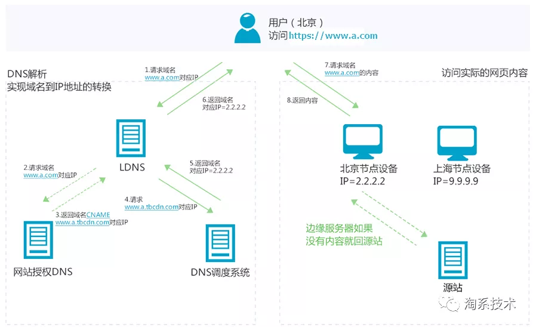
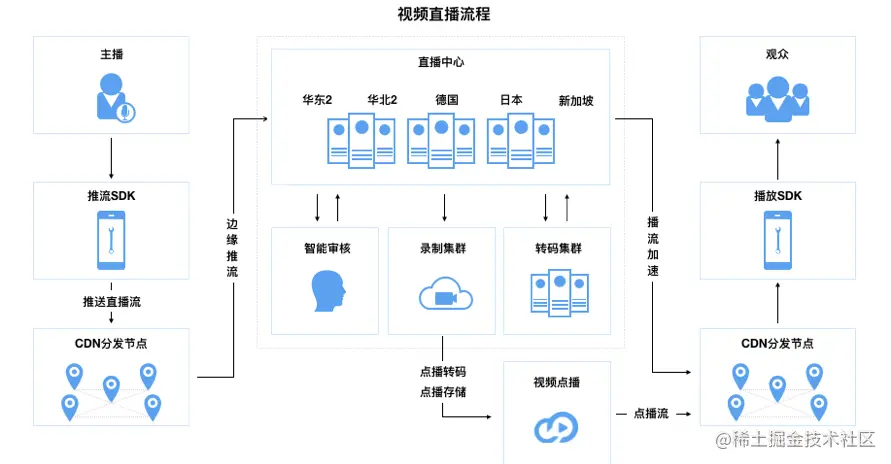

# cdn原理

----------
> 内容分发网络(CDN)是由 分布在不同区域的边缘节点服务器组成的 **分布式网络。**
> 
> 其主要作用是**内容加速**，比如：图片小文件、大文件下载、音视频点播、直播流媒体、全站加速、安全加速。
> 

>
> 如图所示，简单来说就是作用于源站和用户之间的一层内容服务器，
> 
> 主要分布于各个不同区域；
> 
> 客户端发送请求时，会优先访问离自己近的服务器（由dns帮忙查找），这样有助于降低延迟；
> 
> 如果该服务器有对应资源的缓存，则直接返回给用户，否则就去源站请求资源，然后进行缓存；
> 
> 可见，CDN的**加速资源**是和**域名**绑定的，通过域名访问资源，首先会通过DNS查找离自己最近的节点；
> 
> 也是起的一个缓存的作用；
---------

>
> 如图所示为CDN直播的架构示意图；
> 
> 1.主播端采集视频流；
> 
> 2.推流到CDN节点（其实对于云存储来说就是文件的上传过程）
> 
> 3.CDN节点上传到直播中心（源站），通常会让它提供落库存储，视频转码，审核，以及其他一系列服务；
> 
> 4.直播中心分发到CDN节点；
> 
> 5.用户从最近的CDN节点中获取视频内容；
>